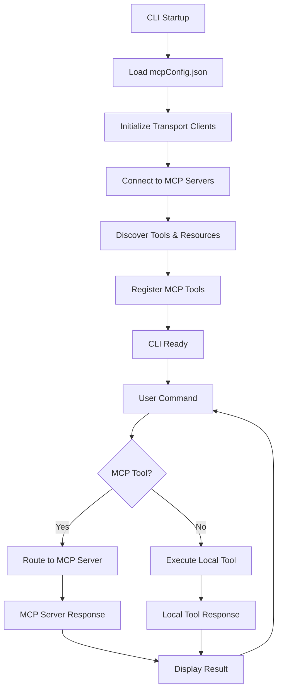

# MCP Integration for Grok CLI - Product Requirements Document

## 1. Product Overview

Integrate Model Context Protocol (MCP) support into the existing Grok CLI to enable communication with MCP servers through multiple transport methods: SSE (Server-Sent Events), STDIO (Standard Input/Output), and Streaming HTTPS.

This enhancement will allow the Grok CLI to connect to external MCP servers that provide additional tools, resources, and capabilities, extending the CLI's functionality beyond the current built-in tools. The integration will use a standardized mcpConfig.json configuration file similar to other MCP providers.

## 2. Core Features

### 2.1 User Roles

| Role      | Registration Method | Core Permissions                                                 |
| --------- | ------------------- | ---------------------------------------------------------------- |
| CLI User  | Direct CLI usage    | Can configure MCP servers, execute MCP tools, manage connections |
| Developer | Code integration    | Can extend MCP configurations, add custom server implementations |

### 2.2 Feature Module

Our MCP integration consists of the following main components:

1. **MCP Configuration Management**: mcpConfig.json file handling, server configuration validation, connection management.
2. **Transport Layer Support**: SSE client implementation, STDIO process management, Streaming HTTPS client.
3. **Protocol Implementation**: MCP message handling, tool discovery, resource access, server lifecycle management.
4. **CLI Integration**: Command interface for MCP operations, server status display, configuration management commands.
5. **Error Handling & Monitoring**: Connection monitoring, error recovery, logging and debugging support.

### 2.3 Page Details

| Component               | Module Name        | Feature Description                                                                                      |
| ----------------------- | ------------------ | -------------------------------------------------------------------------------------------------------- |
| MCP Configuration       | Config Parser      | Load and validate mcpConfig.json, support multiple server definitions, environment variable substitution |
| MCP Configuration       | Config Manager     | Runtime configuration updates, server enable/disable, connection pooling                                 |
| Transport Layer         | SSE Client         | Establish SSE connections, handle event streams, reconnection logic, error handling                      |
| Transport Layer         | STDIO Manager      | Spawn and manage child processes, handle stdin/stdout communication, process lifecycle                   |
| Transport Layer         | HTTPS Client       | Streaming HTTPS connections, WebSocket-like communication, SSL/TLS support                               |
| Protocol Implementation | Message Handler    | MCP protocol message parsing, request/response handling, tool call routing                               |
| Protocol Implementation | Tool Discovery     | Automatic tool discovery from MCP servers, tool registration, capability negotiation                     |
| Protocol Implementation | Resource Access    | Resource listing, content retrieval, subscription management                                             |
| CLI Integration         | MCP Commands       | Add mcp:list, mcp:connect, mcp:disconnect, mcp:status commands                                           |
| CLI Integration         | Tool Integration   | Seamless integration of MCP tools with existing Grok tools, unified tool execution                       |
| Error Handling          | Connection Monitor | Health checks, automatic reconnection, connection status tracking                                        |
| Error Handling          | Error Recovery     | Graceful degradation, fallback mechanisms, error reporting                                               |

## 3. Core Process

### Main User Flow

1. **Configuration Setup**: User creates or modifies mcpConfig.json with server definitions
2. **Server Discovery**: CLI automatically discovers and connects to configured MCP servers on startup
3. **Tool Integration**: MCP tools are seamlessly integrated with existing Grok tools
4. **Command Execution**: User executes commands that may utilize both local and MCP tools
5. **Resource Access**: User can access resources provided by MCP servers
6. **Connection Management**: User can monitor, enable/disable, or reconfigure MCP connections

### Developer Flow

1. **Server Development**: Developer creates MCP server implementation
2. **Configuration**: Developer adds server configuration to mcpConfig.json
3. **Testing**: Developer tests server integration using CLI debug commands
4. **Deployment**: Server is deployed and configured for production use



## 4. User Interface Design

### 4.1 Design Style

* **Primary Colors**: Maintain existing CLI color scheme (cyan for headers, green for success, red for errors)

* **Secondary Colors**: Blue for MCP-specific information, yellow for warnings

* **Text Style**: Monospace font for code/config, regular terminal font for messages

* **Layout Style**: Terminal-based interface with clear hierarchical information display

* **Icons**: Use ASCII symbols and emojis for connection status (🟢 connected, 🔴 disconnected, 🟡 connecting)

* **Progress Indicators**: Spinner animations for connection attempts, progress bars for data transfer

### 4.2 Interface Design Overview

| Component             | Module Name       | UI Elements                                                                                 |
| --------------------- | ----------------- | ------------------------------------------------------------------------------------------- |
| MCP Status Display    | Connection Status | Color-coded server status indicators, connection count, last activity timestamps            |
| MCP Commands          | Command Interface | Structured command output with tables for server lists, tool inventories, resource catalogs |
| Error Display         | Error Messages    | Clear error categorization (connection, protocol, configuration), suggested actions         |
| Configuration Display | Config Viewer     | Formatted JSON display with syntax highlighting, validation status indicators               |
| Tool Integration      | Tool Listing      | Unified tool display showing both local and MCP tools with source indicators                |

### 4.3 Responsiveness

Terminal-based interface that adapts to different terminal sizes, with responsive table layouts and text wrapping for optimal readability across various terminal environments.

## 5. Technical Specifications

### 5.1 Configuration Schema (mcpConfig.json)

```json
{
  "mcpServers": {
    "server-name": {
      "command": "path/to/server",
      "args": ["--arg1", "value1"],
      "transport": "stdio",
      "env": {
        "ENV_VAR": "value"
      },
      "enabled": true
    },
    "sse-server": {
      "url": "https://example.com/mcp",
      "transport": "sse",
      "headers": {
        "Authorization": "Bearer ${API_KEY}"
      },
      "enabled": true
    },
    "https-server": {
      "url": "https://api.example.com/mcp",
      "transport": "https",
      "timeout": 30000,
      "enabled": true
    }
  },
  "globalSettings": {
    "timeout": 10000,
    "retryAttempts": 3,
    "logLevel": "info"
  }
}
```

### 5.2 Dependencies

* **@modelcontextprotocol/sdk**: Core MCP protocol implementation

* **eventsource**: SSE client support

* **ws**: WebSocket support for streaming HTTPS

* **child\_process**: STDIO server management

* **fs-extra**: Configuration file handling

### 5.3 Integration Points

* Extend existing GrokAgent to support MCP tools

* Integrate MCP tools with existing tool execution pipeline

* Add MCP-specific commands to CLI command parser

* Enhance error handling to support MCP connection issues

### 5.4 Performance Considerations

* Connection pooling for multiple MCP servers

* Lazy loading of MCP tools and resources

* Caching of frequently accessed resources

* Asynchronous tool execution to prevent blocking

* Graceful degradation when MCP servers are unavailable

