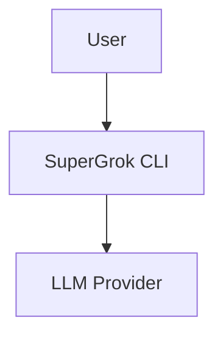

# SuperGrok-CLI v2.0 Architecture Diagrams

This directory contains professional architecture diagrams for SuperGrok-CLI v2.0 in various formats.

## Diagram Types

### Mermaid Diagrams (.mmd)

Mermaid diagrams can be rendered directly in GitHub, GitLab, and many documentation platforms.

**Viewing Mermaid Diagrams:**
- **GitHub/GitLab**: Automatic rendering in markdown preview
- **VS Code**: Install "Markdown Preview Mermaid Support" extension
- **Online**: Use [Mermaid Live Editor](https://mermaid.live/)
- **CLI**: Use `mmdc` command from `@mermaid-js/mermaid-cli`

**Rendering to Image:**
```bash
# Install Mermaid CLI
npm install -g @mermaid-js/mermaid-cli

# Render to PNG
mmdc -i architecture-v2.mmd -o architecture-v2.png

# Render to SVG (recommended for documentation)
mmdc -i architecture-v2.mmd -o architecture-v2.svg

# Batch render all
for file in *.mmd; do mmdc -i "$file" -o "${file%.mmd}.svg"; done
```

### PlantUML Diagrams (.puml)

PlantUML diagrams provide UML-compliant class and deployment diagrams.

**Viewing PlantUML Diagrams:**
- **VS Code**: Install "PlantUML" extension
- **Online**: Use [PlantUML Online Server](http://www.plantuml.com/plantuml/uml/)
- **CLI**: Use `plantuml` command

**Rendering to Image:**
```bash
# Install PlantUML
sudo apt-get install plantuml

# Render to PNG
plantuml class-diagram.puml

# Render to SVG
plantuml -tsvg class-diagram.puml

# Batch render all
plantuml -tsvg *.puml
```

---

## Diagram Inventory

### 1. architecture-v2.mmd
**Type:** System Architecture Diagram (Mermaid)
**Purpose:** Complete system overview showing all layers
**Key Elements:**
- User interfaces (CLI, Desktop, VS Code, API)
- Mode-based orchestrator (5 agent modes)
- Agent intelligence layer
- Tool ecosystem
- Execution layer (cloud/local/hybrid)
- Enterprise governance

**Use Cases:**
- Technical presentations
- Architecture review sessions
- Developer onboarding
- System documentation

**Rendering:**
```bash
mmdc -i architecture-v2.mmd -o architecture-v2.svg -t dark -b transparent
```

---

### 2. mode-transitions.mmd
**Type:** State Machine Diagram (Mermaid)
**Purpose:** Shows how users transition between agent modes
**Key Elements:**
- 5 agent modes (PLAN, ACT, ARCHITECT, REVIEW, CHAT)
- Transition rules and approvals
- Mode characteristics and permissions

**Use Cases:**
- User workflow documentation
- Training materials
- Feature explanation

**Rendering:**
```bash
mmdc -i mode-transitions.mmd -o mode-transitions.svg
```

---

### 3. plugin-architecture.mmd
**Type:** Component Diagram (Mermaid)
**Purpose:** Illustrates plugin system and extensibility
**Key Elements:**
- Core system components
- Plugin types (Tool, Context, Model, UI, Workflow)
- Example plugins
- Plugin registry

**Use Cases:**
- Plugin developer guide
- Extensibility documentation
- Technical marketing

**Rendering:**
```bash
mmdc -i plugin-architecture.mmd -o plugin-architecture.svg
```

---

### 4. execution-flow.mmd
**Type:** Sequence Diagram (Mermaid)
**Purpose:** Shows request flow from user to execution
**Key Elements:**
- User interaction
- Mode checking and approval
- Model selection
- Tool execution
- Git operations

**Use Cases:**
- Developer documentation
- Debugging guide
- System understanding

**Rendering:**
```bash
mmdc -i execution-flow.mmd -o execution-flow.svg
```

---

### 5. git-workflow.mmd
**Type:** Flow Diagram (Mermaid)
**Purpose:** Illustrates git-native operations and transactions
**Key Elements:**
- Repository analysis
- Transaction management
- Validation pipeline
- Commit process
- Rollback path

**Use Cases:**
- Git integration documentation
- Feature explanation
- Developer guide

**Rendering:**
```bash
mmdc -i git-workflow.mmd -o git-workflow.svg
```

---

### 6. enterprise-compliance.mmd
**Type:** Flow Diagram (Mermaid)
**Purpose:** Shows enterprise governance and compliance features
**Key Elements:**
- Policy configuration
- Request pipeline
- Execution controls
- Audit trail
- Compliance reporting

**Use Cases:**
- Enterprise sales presentations
- Compliance documentation
- Security audits

**Rendering:**
```bash
mmdc -i enterprise-compliance.mmd -o enterprise-compliance.svg
```

---

### 7. multi-model-routing.mmd
**Type:** Decision Flow Diagram (Mermaid)
**Purpose:** Explains multi-model orchestration strategy
**Key Elements:**
- Task classification
- Model selection logic
- Cost optimization
- Performance tracking
- Feedback loop

**Use Cases:**
- Cost optimization documentation
- Model selection guide
- Technical marketing

**Rendering:**
```bash
mmdc -i multi-model-routing.mmd -o multi-model-routing.svg
```

---

### 8. class-diagram.puml
**Type:** UML Class Diagram (PlantUML)
**Purpose:** Technical class structure and relationships
**Key Elements:**
- Core agent classes
- Git integration classes
- Plugin system interfaces
- Model management
- Enterprise governance

**Use Cases:**
- Developer documentation
- Code review reference
- API documentation

**Rendering:**
```bash
plantuml -tsvg class-diagram.puml
```

---

### 9. deployment.puml
**Type:** UML Deployment Diagram (PlantUML)
**Purpose:** Infrastructure and deployment architecture
**Key Elements:**
- Developer workstation
- Cloud infrastructure
- Local infrastructure
- Enterprise services
- Git repositories

**Use Cases:**
- Deployment guide
- Infrastructure planning
- DevOps documentation

**Rendering:**
```bash
plantuml -tsvg deployment.puml
```

---

## Embedding Diagrams in Documentation

### Markdown (GitHub/GitLab)

**Mermaid (Inline):**
````markdown

````

**Mermaid (External File):**
```markdown

```

**PlantUML (External File):**
```markdown

```

### HTML Documentation

```html

```

### PDF Generation

```bash
# Using pandoc with SVG diagrams
pandoc ROADMAP_V2.0_PROFESSIONAL.md \
  --from markdown \
  --to pdf \
  --output roadmap-v2.pdf \
  --pdf-engine=xelatex
```

---

## Diagram Standards

### Color Coding

**Standard Colors (Mermaid):**
```
Read-Only Modes    : #e1f5ff (Light Blue)
Read-Write Modes   : #ffe1e1 (Light Red)
Design Modes       : #fff3e1 (Light Orange)
Analysis Modes     : #e8ffe1 (Light Green)
General Modes      : #f0e1ff (Light Purple)

Core Components    : #4a90e2 (Blue)
Intelligence Layer : #ffd700 (Gold)
Enterprise Layer   : #ff6b6b (Red)
Plugin System      : #50e3c2 (Teal)

Success State      : #90EE90 (Light Green)
Warning State      : #FFD700 (Gold)
Error State        : #FF6B6B (Red)
```

### Naming Conventions

- Files: `kebab-case.mmd` or `kebab-case.puml`
- Nodes: `CamelCase` for classes, `Title Case` for labels
- Edges: Meaningful relationship names

### Documentation

Each diagram should include:
- Header comment with purpose
- Key elements description
- Use case examples
- Rendering instructions

---

## Updating Diagrams

### Workflow

1. **Edit Source:** Modify `.mmd` or `.puml` file
2. **Preview:** Use IDE extension or online editor
3. **Render:** Generate `.svg` or `.png` output
4. **Verify:** Check rendering quality
5. **Commit:** Add both source and rendered files

### Best Practices

- Keep diagrams simple and focused
- Use consistent color schemes
- Add notes for complex elements
- Version control both source and rendered files
- Update documentation when diagrams change

---

## Tools and Resources

### Recommended Tools

**Mermaid:**
- [Mermaid Live Editor](https://mermaid.live/) - Online editor
- [Mermaid CLI](https://github.com/mermaid-js/mermaid-cli) - Command line tool
- [VS Code Extension](https://marketplace.visualstudio.com/items?itemName=bierner.markdown-mermaid) - IDE support

**PlantUML:**
- [PlantUML Online](http://www.plantuml.com/plantuml/) - Online editor
- [PlantUML CLI](https://plantuml.com/command-line) - Command line tool
- [VS Code Extension](https://marketplace.visualstudio.com/items?itemName=jebbs.plantuml) - IDE support

**General:**
- [Draw.io](https://www.drawio.com/) - Visual diagram editor
- [Excalidraw](https://excalidraw.com/) - Hand-drawn style diagrams
- [Graphviz](https://graphviz.org/) - Graph visualization

### Documentation

- [Mermaid Documentation](https://mermaid-js.github.io/mermaid/)
- [PlantUML Documentation](https://plantuml.com/)
- [Diagram as Code Guide](https://diagrams.mingrammer.com/)

---

## Maintenance

**Last Updated:** 2025-10-26
**Maintainer:** SuperGrok Development Team
**Review Cycle:** Quarterly or with major architecture changes

**Change Log:**
- 2025-10-26: Initial diagram set created for v2.0
- Future updates will be documented here

---

*End of Diagram Documentation*
